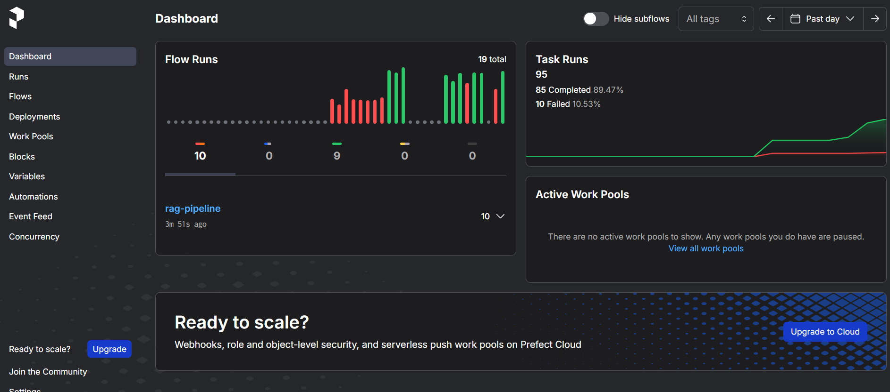
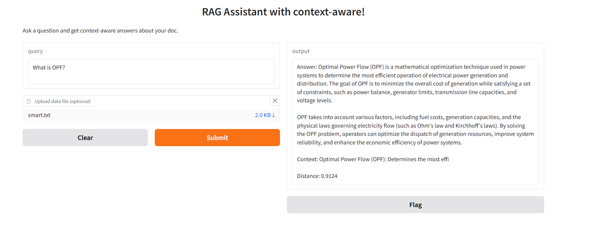

# LLMOps + Prefect + Gradio + RAG_chat

A simple Retrieval-Augmented Generation (RAG) pipeline using OpenAI, FAISS, Prefect, and Gradio. This project allows you to upload your own text file, ask questions, and get context-aware answers from your documents.




## Features

- Upload your own `.txt` file (one document per line)
- Uses OpenAI embeddings and GPT-4o-mini for answers
- Fast vector search with FAISS
- Orchestrated with Prefect
- Simple Gradio web interface

---

## How It Works

1. **Document Loading:**  
   The app loads your documents from a `.txt` file, with each line treated as a separate document.

2. **Chunking:**  
   Each document is split into smaller chunks (default: 50 characters) to improve retrieval accuracy.

3. **Embedding:**  
   All chunks are converted into vector embeddings using OpenAI's embedding model.

4. **Indexing:**  
   The embeddings are indexed using FAISS for fast similarity search.

5. **Querying:**  
   When you ask a question, it is embedded and compared to all chunks to find the most relevant context.

6. **Answer Generation:**  
   The most relevant chunk and your question are sent to OpenAI's GPT-4o-mini model, which generates a context-aware answer.

7. **Result:**  
   The answer, the context used, and the similarity distance are displayed in the Gradio interface.

---

## Setup Instructions

### 1. Clone the Repository

```sh
git clone https://github.com/yourusername/LLMfromZero.git
cd LLMfromZero
```

### 2. Create and Activate a Virtual Environment (Recommended)

```sh
python -m venv venv
venv\Scripts\activate   # On Windows
# source venv/bin/activate  # On macOS/Linux
```

### 3. Install Dependencies

```sh
pip install -r requirements.txt
```

If you don't have a `requirements.txt`, install manually:

```sh
pip install openai faiss-cpu numpy python-dotenv gradio prefect
```

### 4. Set Up OpenAI API Key

- Create a `.env` file in the project root:
  ```
  OPENAI_API_KEY=your_openai_api_key_here
  ```

### 5. Prepare Your Data

- Create a `data.txt` file in the project root.
- Each line should be a separate document.
- Example:
  ```
  Large language models have revolutionized AI.
  Prefect is a powerful workflow orchestration tool.
  FAISS helps efficiently search vector embeddings.
  ```

### 6. Run the Application

```sh
python ui.py
```

- This will launch a Gradio web interface in your browser.

---

## Usage

1. **Upload a `.txt` file** (optional; if not uploaded, `data.txt` is used by default).
2. **Type your question** in the textbox.
3. **Submit** and receive an answer, the context used, and the similarity distance.

---

## Why We Use Prefect

Prefect is used in this project to orchestrate the RAG pipeline as a clear, maintainable, and observable workflow. With Prefect, each step of the pipeline (loading data, chunking, embedding, indexing, querying, and answering) is defined as a separate task within a flow. This provides:

- **Visibility:** You can visualize the execution graph and monitor each step in the Prefect UI.
- **Reliability:** Prefect handles task dependencies, retries, and error handling.
- **Modularity:** Each part of the pipeline is reusable and easy to modify or extend.
- **Scalability:** Prefect makes it easier to scale and schedule your workflows for production use.

You can run and monitor the pipeline using Prefect's CLI and UI, making development and debugging much easier.

---

## File Structure

- `pipeline.py` — The main RAG pipeline logic.
- `ui.py` — Gradio web interface.
- `.env` — Your OpenAI API key (not committed to git).
- `.gitignore` — Ignores sensitive and unnecessary files.
- `data.txt` — Your default document file.

---

## Notes

- Make sure your `.env` file is **not** committed to GitHub.
- For best results, use clear, concise lines in your data file.
- You can customize chunk size and other parameters in `pipeline.py`.

---

## License

MIT License

---

## Acknowledgements

- [OpenAI](https://openai.com/)
- [FAISS](https://github.com/facebookresearch/faiss)
- [Prefect](https://www.prefect.io/)
- [Gradio](https://www.gradio.app/)
